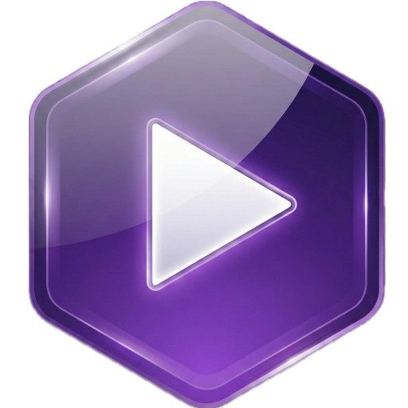

<div align="center">
  
  <h1>Onyx Downloader</h1>

  
  
  
  

  
  
</div>

**Onyx Downloader** is a modern, privacy-focused, and premium desktop application for downloading and managing YouTube content. Built with Rust and the Iced GUI framework, it delivers a sleek, responsive experience with zero bloat.

Whether you need to archive entire playlists, extract high-quality audio, or create quick clips, Onyx handles it with style.

---

## 🛡️ Compliance & Security

Onyx Downloader is built with security and transparency in mind.

*   **[Security Report](SECURITY.md)**: View our latest vulnerability assessment and security practices.
*   **[Bill of Materials (BOM)](BOM.json)**: Full list of all dependencies and their licenses.

---

## ✨ Key Features

*   **🚀 Modern, Fast UI**: Built using `iced`, ensuring native performance and a fluid user experience.
*   **🎥 High-Quality Downloads**: Support for 4K/8K video downloads and high-bitrate audio extraction.
*   **✂️ Precise Trimming**: Built-in video player with an intuitive timeline editor to download specific clips without grabbing the whole file.
*   **📚 Batch Queue**: Add multiple videos to a queue and let Onyx handle them in the background.
*   **🕵️ Privacy-First**: Optional proxy support and cookie management to keep your browsing private.
*   **🎨 Dynamic Themes**: Automatically adapts to system themes or switch manually between "Default" (Blue) and "Vibrant" (Cyan) modes.
*   **📦 Zero-Install Dependencies**: The application manages its own dependencies (like `ffmpeg`, `yt-dlp`) automatically on first run.

---

## 🛠️ Build Requirements

Onyx relies on several system libraries, particularly **GStreamer** for media handling and **GTK/GLib** for system integration.

### Core Dependencies
*   **Rust** (1.75+)
*   **GStreamer 1.0** (Core, Base, Good, Bad, Ugly plugins)
*   **OpenSSL** & **CA Certificates**
*   **FFmpeg** (runtime dependency, auto-downloaded if missing)
*   **Pkg-Config** (build time)

---

## 🐧 Building on Linux

We strictly recommend using **Nix** for a consistent development environment, as GStreamer setup on disparate Linux distros can be tricky.

### Option 1: Using Nix (Recommended)

1.  **Install Nix**: Usually available in your package manager or via the official installer.
2.  **Enter the Shell**: Run `nix-shell` in the project root. This downloads and configures all dependencies (Rust, GStreamer, pkg-config, fonts).
3.  **Run**:
    ```bash
    nix-shell --run "cargo run --release"
    ```

### Option 2: Manual Build (Ubuntu/Debian)

1.  **Install Dependencies**:
    ```bash
    sudo apt update
    sudo apt install build-essential pkg-config libssl-dev libglib2.0-dev libgstreamer1.0-dev libgstreamer-plugins-base1.0-dev libgstreamer-plugins-bad1.0-dev gstreamer1.0-plugins-base gstreamer1.0-plugins-good gstreamer1.0-plugins-bad gstreamer1.0-plugins-ugly gstreamer1.0-libav
    ```
2.  **Clone & Run**:
    ```bash
    cargo run --release
    ```

### Option 3: Flatpak (Universal Linux Package)

For a sandboxed, distribution-independent build, use Flatpak.

1.  **Install Flatpak & Builder**:
    ```bash
    # Ubuntu/Debian
    sudo apt install flatpak flatpak-builder
    # Fedora
    sudo dnf install flatpak flatpak-builder
    ```

2.  **Add Flathub & Install Runtime**:
    ```bash
    flatpak remote-add --if-not-exists flathub https://flathub.org/repo/flathub.flatpakrepo
    flatpak install --user   org.freedesktop.Sdk/x86_64/25.08   org.freedesktop.Platform/x86_64/25.08   org.freedesktop.Sdk.Extension.rust-stable/x86_64/25.08
    ```

3.  **Build & Install**:
    ```bash
    # Build locally and install to user repository
    flatpak-builder --user --install --force-clean build-dir com.onyx.yt-frontend.yml
    ```

4.  **Run**:
    ```bash
    flatpak run com.onyx.yt-frontend
    ```

---

## ⚡ Unified Build Commands

We have configured Cargo aliases to simplify packaging:

*   **Linux Flatpak**: `cargo bundle-linux`
    *   Runs `scripts/bundle_flatpak.sh`
*   **macOS Bundle**: `cargo bundle-mac`
    *   Runs `scripts/bundle_macos.sh`

---

## 🍎 Building on macOS

Building media applications on macOS requires careful handling of frameworks and code signing. We provide a bundled script to automate this.

### Option 1: Using Nix (Recommended)

1.  **Run Nix Shell**: ensure you have `nix-shell` available.
2.  **Bundle & Run**:
    ```bash
    # Enter environment
    nix-shell
    
    # Run the bundler script (Handles cargo build, library fixing, and signing)
    ./scripts/bundle_macos.sh
    
    # The resulting .app will be in target/release/bundle/osx/
    open target/release/bundle/osx/Onyx.app
    ```

### Important macOS Notes:
*   The build script (`scripts/bundle_macos.sh`) handles **Ad-Hoc Signing** automatically.
*   On Apple Silicon, you must sign binaries for them to run. The script takes care of this.
*   The first launch might ask for network permissions.

---

## 🚀 Usage Guide

### 1. Quick Download Tab
Paste a YouTube URL and hit enter. Onyx instantly fetches metadata. Select your format (Video/Audio) and click **Download**. Use the **Trim** checkboxes to specify start/end times if you only want a clip.

### 2. Batch Queue Tab
Paste multiple URLs here to build a list. You can edit each item individually (format, crop, trim) before starting the batch process. Ideal for playlist archiving.

### 3. Settings Tab
Configure advanced options:
*   **Proxy**: Set a custom HTTP/S proxy.
*   **Cookies**: Load cookies from your browser to access age-gated content (requires a `cookies.txt` or browser selection).
*   **API Key**: Use your own YouTube Data API key for faster search results.

---

## 🤝 Contributing

Contributions are welcome!

1.  Fork the repository.
2.  Create a feature branch (`git checkout -b feature/amazing-feature`).
3.  Commit your changes.
4.  Open a Pull Request.

Please ensure `cargo test` passes before submitting.

---

## � Acknowledgements

Onyx is built on the shoulders of giants. We gratefully acknowledge the following open-source projects:

*   **[Iced](https://github.com/iced-rs/iced)**: The amazing cross-platform GUI library for Rust.
*   **[yt-dlp](https://github.com/yt-dlp/yt-dlp)**: The engine behind the downloads.
*   **[FFmpeg](https://ffmpeg.org/)**: For world-class multimedia processing.
*   **[GStreamer](https://gstreamer.freedesktop.org/)**: The backbone of our media playback.
*   **[Tokio](https://tokio.rs/)**: Rust's asynchronous runtime.
*   **[Reqwest](https://github.com/seanmonstar/reqwest)**: An ergonomic HTTP Client for Rust.
*   **[Serde](https://serde.rs/)**: Serialization framework for Rust.
*   **[iced_video_player](https://github.com/jazzfool/iced_video_player)**: Video player widget integration.
*   **[Lofty](https://github.com/Serial-ATA/lofty-rs)**: Audio metadata tagging.

---

## �📜 License

Released under the MIT License.
